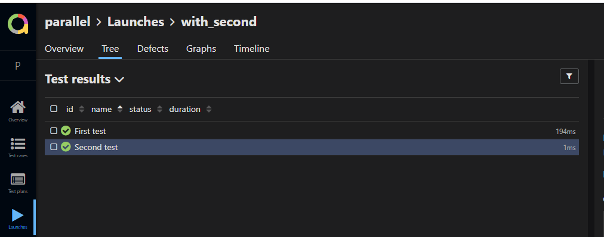
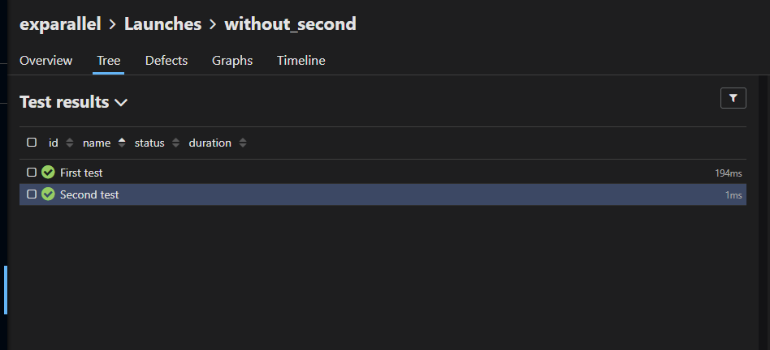

# bug-example

i run in parallel two tasks and excluded test execution result appears in second allure-report (Enterprise edition)

Task with all tests

Task with excluded Second test (Second test should not be here)
